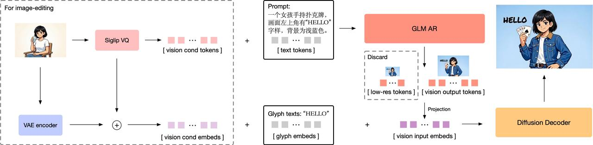
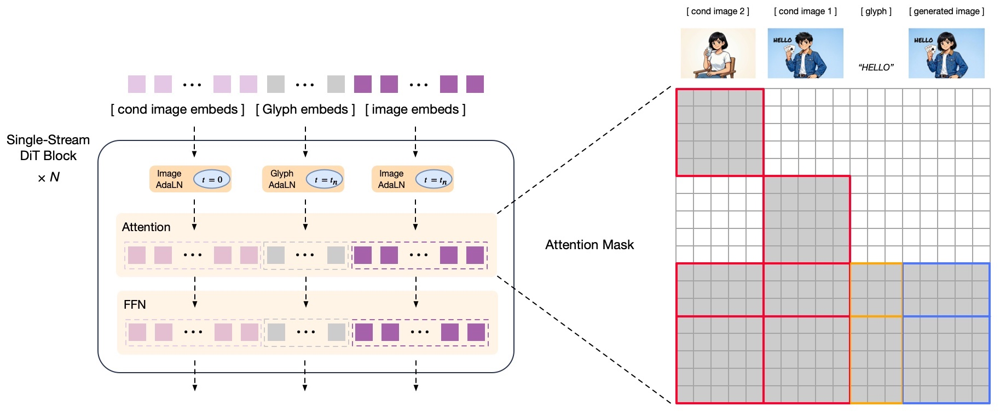
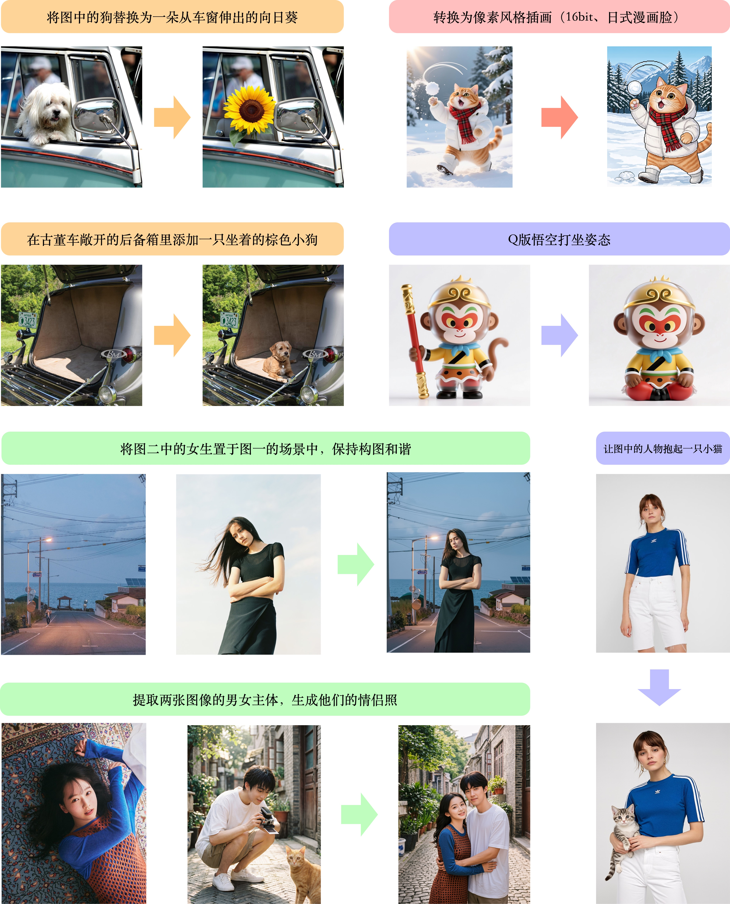

# GLM-Image

<div align="center">

</div>
<p align="center">
    👋 Join our <a href="resources/WECHAT.md" target="_blank">WeChat</a> and <a href="https://discord.gg/8KFjEec7" target="_blank">Discord</a> community
    <br>
    📖 Check out GLM-Image's <a href="https://z.ai/blog/glm-image" target="_blank">Technical Blog</a>
    <br>
    📍 Use GLM-Image's <a href="https://docs.z.ai/guides/image/glm-image" target="_blank">API</a>
</p>


## Introduction

GLM-Image is an image generation model adopts a hybrid autoregressive + diffusion decoder architecture. In general image generation quality, GLM‑Image aligns with mainstream latent diffusion approaches, but it shows significant advantages in text-rendering and knowledge‑intensive generation scenarios. It performs especially well in tasks requiring precise semantic understanding and complex information expression, while maintaining strong capabilities in high‑fidelity and fine‑grained detail generation. In addition to text‑to‑image generation, GLM‑Image also supports a rich set of image‑to‑image tasks including image editing, style transfer, identity‑preserving generation, and multi‑subject consistency.

Model architecture: a hybrid autoregressive + diffusion decoder design.



+ Autoregressive generator: a 9B-parameter model initialized from [GLM-4-9B-0414](https://huggingface.co/zai-org/GLM-4-9B-0414), with an expanded vocabulary to incorporate visual tokens. The model first generates a compact encoding of approximately 256 tokens, then expands to 1K–4K tokens, corresponding to 1K–2K high-resolution image outputs.
+ Diffusion Decoder: a 7B-parameter decoder based on a single-stream DiT architecture for latent-space image decoding. It is equipped with a Glyph Encoder text module, significantly improving accurate text rendering within images.



Post-training with decoupled reinforcement learning: the model introduces a fine-grained, modular feedback strategy using the GRPO algorithm, substantially enhancing both semantic understanding and visual detail quality.

+ Autoregressive module: provides low-frequency feedback signals focused on aesthetics and semantic alignment, improving instruction following and artistic expressiveness.
+ Decoder module: delivers high-frequency feedback targeting detail fidelity and text accuracy, resulting in highly realistic textures as well as more precise text rendering.

GLM-Image supports both text-to-image and image-to-image generation within a single model.

+ Text-to-image: generates high-detail images from textual descriptions, with particularly strong performance in information-dense scenarios.
+ Image-to-image: supports a wide range of tasks, including image editing, style transfer, multi-subject consistency, and identity-preserving generation for people and objects.

## Showcase

### T2I with dense text and knowledge


### I2I



## Quick Start

### transformers + diffusers Pipeline

Install transformers and diffusers from source:

```shell
pip install git+https://github.com/huggingface/transformers.git
pip install git+https://github.com/huggingface/diffusers.git
```

+ Text to Image Generation

```python
import torch
from diffusers.pipelines.glm_image import GlmImagePipeline

pipe = GlmImagePipeline.from_pretrained("zai-org/GLM-Image", torch_dtype=torch.bfloat16, device_map="cuda")
prompt = "A beautifully designed modern food magazine style dessert recipe illustration, themed around a raspberry mousse cake. The overall layout is clean and bright, divided into four main areas: the top left features a bold black title 'Raspberry Mousse Cake Recipe Guide', with a soft-lit close-up photo of the finished cake on the right, showcasing a light pink cake adorned with fresh raspberries and mint leaves; the bottom left contains an ingredient list section, titled 'Ingredients' in a simple font, listing 'Flour 150g', 'Eggs 3', 'Sugar 120g', 'Raspberry puree 200g', 'Gelatin sheets 10g', 'Whipping cream 300ml', and 'Fresh raspberries', each accompanied by minimalist line icons (like a flour bag, eggs, sugar jar, etc.); the bottom right displays four equally sized step boxes, each containing high-definition macro photos and corresponding instructions, arranged from top to bottom as follows: Step 1 shows a whisk whipping white foam (with the instruction 'Whip egg whites to stiff peaks'), Step 2 shows a red-and-white mixture being folded with a spatula (with the instruction 'Gently fold in the puree and batter'), Step 3 shows pink liquid being poured into a round mold (with the instruction 'Pour into mold and chill for 4 hours'), Step 4 shows the finished cake decorated with raspberries and mint leaves (with the instruction 'Decorate with raspberries and mint'); a light brown information bar runs along the bottom edge, with icons on the left representing 'Preparation time: 30 minutes', 'Cooking time: 20 minutes', and 'Servings: 8'. The overall color scheme is dominated by creamy white and light pink, with a subtle paper texture in the background, featuring compact and orderly text and image layout with clear information hierarchy."
image = pipe(
    prompt=prompt,
    height=32 * 32,
    width=36 * 32,
    num_inference_steps=30,
    guidance_scale=1.5,
    generator=torch.Generator(device="cuda").manual_seed(42),
).images[0]

image.save("output_t2i.png")
```

+ Image to Image Generation

```python
import torch
from diffusers.pipelines.glm_image import GlmImagePipeline
from PIL import Image

pipe = GlmImagePipeline.from_pretrained("zai-org/GLM-Image", torch_dtype=torch.bfloat16, device_map="cuda")
image_path = "cond.jpg"
prompt = "Replace the background of the snow forest with an underground station featuring an automatic escalator."
image = Image.open(image_path).convert("RGB")
image = pipe(
    prompt=prompt,
    image=[image],  # can input multiple images for multi-image-to-image generation such as [image, image1]
    height=33 * 32, # Must set height even it is same as input image
    width=32 * 32, # Must set width even it is same as input image
    num_inference_steps=30,
    guidance_scale=1.5,
    generator=torch.Generator(device="cuda").manual_seed(42),
).images[0]

image.save("output_i2i.png")
```

### SGLang Pipeline

Install transformers and diffusers from source:

```
pip install "sglang[diffusion] @ git+https://github.com/sgl-project/sglang.git#subdirectory=python"
pip install git+https://github.com/huggingface/transformers.git
pip install git+https://github.com/huggingface/diffusers.git
```

+ Text to Image Generation

```
sglang serve --model-path zai-org/GLM-Image

curl http://localhost:30000/v1/images/generations \
  -H "Content-Type: application/json" \
  -d '{
    "model": "zai-org/GLM-Image",
    "prompt": "Doraemon is flying in the sky.",
    "n": 1,
    "response_format": "b64_json",
    "size": "1024x1024"
  }' |  python3 -c "import sys, json, base64; open('output_t2i.png', 'wb').write(base64.b64decode(json.load(sys.stdin)['data'][0]['b64_json']))"
```

+ Image to Image Generation

```
sglang serve --model-path zai-org/GLM-Image

curl -s -X POST "http://localhost:30000/v1/images/edits" \
-F "model=zai-org/GLM-Image" \
-F "image=@cond.jpg" \
-F "prompt=Replace the background of the snow forest with an underground station featuring an automatic escalator." \
-F "response_format=b64_json"  | python3 -c "import sys, json, base64; open('output_i2i.png', 'wb').write(base64.b64decode(json.load(sys.stdin)['data'][0]['b64_json']))"
```

### Note

+ We strongly recommend to use GLM-4.7 to enhance prompts for higher image quality, Please check [script](examples/prompt_utils.py) for more details.
+ The AR model used in GLM‑Image is configured with `do_sample=True`, a temperature of `0.9`, and a topp of `0.75` by default. A higher temperature results in more diverse and rich outputs, but it can also lead to a certain decrease in output stability.
+ The target image resolution must be divisible by 32. Otherwise, it will throw an error.
+ Because the inference optimizations for this architecture are currently limited, the runtime cost is still relatively high. It requires either a single GPU with more than 80GB of memory, or a multi-GPU setup.
+ vLLM-Omni and SGLang (with AR speedup) support is currently being integrated — stay tuned.

### Inference Cost

The following data was tested on a single `H100` with `diffusers` lib and can be used to estimate inference cost and time. This table may be updated after future optimizations.

| Resolution | Batch Size | Type | End-to-End Time (s) | Peak VRAM (GB) | Note                                             |
|------------|------------|------|---------------------|----------------|--------------------------------------------------|
| 2048×2048  | 1          | T2I  | 252.59              | 45.08          | Fixed prompt, ~1000 tokens                       |
| 1024×1024  | 1          | T2I  | 64.34               | 37.82          | Fixed prompt, ~1000 tokens                       |
| 1024×1024  | 4          | T2I  | 108.22              | 52.09          | Fixed prompt, ~1000 tokens                       |
| 512×512    | 1          | T2I  | 27.30               | 34.26          | Fixed prompt, ~1000 tokens                       |
| 512×512    | 4          | T2I  | 39.34               | 37.83          | Fixed prompt, ~1000 tokens                       |
| 2048×2048  | 1          | I2I  | 274.51              | 45.08          | Reference image same size as target, ~100 tokens |
| 1024×1024  | 1          | I2I  | 58.64               | 37.83          | Reference image same size as target, ~100 tokens |

## Model Performance

### Text Rendering

<div style="overflow-x: auto; margin-bottom: 16px;">
  <table style="border-collapse: collapse; width: 100%;">
    <thead>
      <tr>
        <th style="white-space: nowrap; padding: 8px; border: 1px solid #d0d7de; background-color: #f6f8fa;" rowspan="2">Model</th>
        <th style="white-space: nowrap; padding: 8px; border: 1px solid #d0d7de; background-color: #f6f8fa;" rowspan="2">Open Source</th>
        <th style="padding: 8px; border: 1px solid #d0d7de; background-color: #f6f8fa; text-align: center;" colspan="3">CVTG-2K</th>
        <th style="padding: 8px; border: 1px solid #d0d7de; background-color: #f6f8fa; text-align: center;" colspan="3">LongText-Bench</th>
      </tr>
      <tr>
        <th style="white-space: nowrap; padding: 8px; border: 1px solid #d0d7de; background-color: #f6f8fa; text-align: center;">Word Accuracy</th>
        <th style="padding: 8px; border: 1px solid #d0d7de; background-color: #f6f8fa; text-align: center;">NED</th>
        <th style="padding: 8px; border: 1px solid #d0d7de; background-color: #f6f8fa; text-align: center;">CLIPScore</th>
        <th style="padding: 8px; border: 1px solid #d0d7de; background-color: #f6f8fa; text-align: center;">AVG</th>
        <th style="padding: 8px; border: 1px solid #d0d7de; background-color: #f6f8fa; text-align: center;">EN</th>
        <th style="padding: 8px; border: 1px solid #d0d7de; background-color: #f6f8fa; text-align: center;">ZH</th>
      </tr>
    </thead>
    <tbody>
      <tr>
        <td style="padding: 8px; border: 1px solid #d0d7de;white-space:nowrap;">Seedream 4.5</td>
        <td style="padding: 8px; border: 1px solid #d0d7de; text-align: center;">✗</td>
        <td style="padding: 8px; border: 1px solid #d0d7de; text-align: center;">0.8990</td>
        <td style="padding: 8px; border: 1px solid #d0d7de; text-align: center;">0.9483</td>
        <td style="padding: 8px; border: 1px solid #d0d7de; text-align: center;"><strong>0.8069</strong></td>
        <td style="padding: 8px; border: 1px solid #d0d7de; text-align: center;"><strong>0.988</strong></td>
        <td style="padding: 8px; border: 1px solid #d0d7de; text-align: center;"><strong>0.989</strong></td>
        <td style="padding: 8px; border: 1px solid #d0d7de; text-align: center;"><strong>0.987</strong></td>
      </tr>
      <tr>
        <td style="padding: 8px; border: 1px solid #d0d7de;white-space:nowrap;">Seedream 4.0</td>
        <td style="padding: 8px; border: 1px solid #d0d7de; text-align: center;">✗</td>
        <td style="padding: 8px; border: 1px solid #d0d7de; text-align: center;">0.8451</td>
        <td style="padding: 8px; border: 1px solid #d0d7de; text-align: center;">0.9224</td>
        <td style="padding: 8px; border: 1px solid #d0d7de; text-align: center;">0.7975</td>
        <td style="padding: 8px; border: 1px solid #d0d7de; text-align: center;">0.924</td>
        <td style="padding: 8px; border: 1px solid #d0d7de; text-align: center;">0.921</td>
        <td style="padding: 8px; border: 1px solid #d0d7de; text-align: center;">0.926</td>
      </tr>
      <tr>
        <td style="padding: 8px; border: 1px solid #d0d7de;white-space:nowrap;">Nano Banana 2.0</td>
        <td style="padding: 8px; border: 1px solid #d0d7de; text-align: center;">✗</td>
        <td style="padding: 8px; border: 1px solid #d0d7de; text-align: center;">0.7788</td>
        <td style="padding: 8px; border: 1px solid #d0d7de; text-align: center;">0.8754</td>
        <td style="padding: 8px; border: 1px solid #d0d7de; text-align: center;">0.7372</td>
        <td style="padding: 8px; border: 1px solid #d0d7de; text-align: center;">0.965</td>
        <td style="padding: 8px; border: 1px solid #d0d7de; text-align: center;">0.981</td>
        <td style="padding: 8px; border: 1px solid #d0d7de; text-align: center;">0.949</td>
      </tr>
      <tr>
        <td style="padding: 8px; border: 1px solid #d0d7de;white-space:nowrap;">GPT Image 1 [High]</td>
        <td style="padding: 8px; border: 1px solid #d0d7de; text-align: center;">✗</td>
        <td style="padding: 8px; border: 1px solid #d0d7de; text-align: center;">0.8569</td>
        <td style="padding: 8px; border: 1px solid #d0d7de; text-align: center;">0.9478</td>
        <td style="padding: 8px; border: 1px solid #d0d7de; text-align: center;">0.7982</td>
        <td style="padding: 8px; border: 1px solid #d0d7de; text-align: center;">0.788</td>
        <td style="padding: 8px; border: 1px solid #d0d7de; text-align: center;">0.956</td>
        <td style="padding: 8px; border: 1px solid #d0d7de; text-align: center;">0.619</td>
      </tr>
      <tr>
        <td style="padding: 8px; border: 1px solid #d0d7de;white-space:nowrap;">Qwen-Image</td>
        <td style="padding: 8px; border: 1px solid #d0d7de; text-align: center;">✓</td>
        <td style="padding: 8px; border: 1px solid #d0d7de; text-align: center;">0.8288</td>
        <td style="padding: 8px; border: 1px solid #d0d7de; text-align: center;">0.9116</td>
        <td style="padding: 8px; border: 1px solid #d0d7de; text-align: center;">0.8017</td>
        <td style="padding: 8px; border: 1px solid #d0d7de; text-align: center;">0.945</td>
        <td style="padding: 8px; border: 1px solid #d0d7de; text-align: center;">0.943</td>
        <td style="padding: 8px; border: 1px solid #d0d7de; text-align: center;">0.946</td>
      </tr>
      <tr>
        <td style="padding: 8px; border: 1px solid #d0d7de;white-space:nowrap;">Qwen-Image-2512</td>
        <td style="padding: 8px; border: 1px solid #d0d7de; text-align: center;">✓</td>
        <td style="padding: 8px; border: 1px solid #d0d7de; text-align: center;">0.8604</td>
        <td style="padding: 8px; border: 1px solid #d0d7de; text-align: center;">0.9290</td>
        <td style="padding: 8px; border: 1px solid #d0d7de; text-align: center;">0.7819</td>
        <td style="padding: 8px; border: 1px solid #d0d7de; text-align: center;">0.961</td>
        <td style="padding: 8px; border: 1px solid #d0d7de; text-align: center;">0.956</td>
        <td style="padding: 8px; border: 1px solid #d0d7de; text-align: center;">0.965</td>
      </tr>
      <tr>
        <td style="padding: 8px; border: 1px solid #d0d7de;white-space:nowrap;">Z-Image</td>
        <td style="padding: 8px; border: 1px solid #d0d7de; text-align: center;">✓</td>
        <td style="padding: 8px; border: 1px solid #d0d7de; text-align: center;">0.8671</td>
        <td style="padding: 8px; border: 1px solid #d0d7de; text-align: center;">0.9367</td>
        <td style="padding: 8px; border: 1px solid #d0d7de; text-align: center;">0.7969</td>
        <td style="padding: 8px; border: 1px solid #d0d7de; text-align: center;">0.936</td>
        <td style="padding: 8px; border: 1px solid #d0d7de; text-align: center;">0.935</td>
        <td style="padding: 8px; border: 1px solid #d0d7de; text-align: center;">0.936</td>
      </tr>
      <tr>
        <td style="padding: 8px; border: 1px solid #d0d7de;white-space:nowrap;">Z-Image-Turbo</td>
        <td style="padding: 8px; border: 1px solid #d0d7de; text-align: center;">✓</td>
        <td style="padding: 8px; border: 1px solid #d0d7de; text-align: center;">0.8585</td>
        <td style="padding: 8px; border: 1px solid #d0d7de; text-align: center;">0.9281</td>
        <td style="padding: 8px; border: 1px solid #d0d7de; text-align: center;">0.8048</td>
        <td style="padding: 8px; border: 1px solid #d0d7de; text-align: center;">0.922</td>
        <td style="padding: 8px; border: 1px solid #d0d7de; text-align: center;">0.917</td>
        <td style="padding: 8px; border: 1px solid #d0d7de; text-align: center;">0.926</td>
      </tr>
      <tr>
        <td style="padding: 8px; border: 1px solid #d0d7de;white-space:nowrap;"><strong>GLM-Image</strong></td>
        <td style="padding: 8px; border: 1px solid #d0d7de; text-align: center;">✓</td>
        <td style="padding: 8px; border: 1px solid #d0d7de; text-align: center;"><strong>0.9116</strong></td>
        <td style="padding: 8px; border: 1px solid #d0d7de; text-align: center;"><strong>0.9557</strong></td>
        <td style="padding: 8px; border: 1px solid #d0d7de; text-align: center;">0.7877</td>
        <td style="padding: 8px; border: 1px solid #d0d7de; text-align: center;">0.966</td>
        <td style="padding: 8px; border: 1px solid #d0d7de; text-align: center;">0.952</td>
        <td style="padding: 8px; border: 1px solid #d0d7de; text-align: center;">0.979</td>
      </tr>
    </tbody>
  </table>
</div>

### Text-to-Image

<div style="overflow-x: auto; margin-bottom: 16px;">
  <table style="border-collapse: collapse; width: 100%;">
    <thead>
      <tr>
        <th style="white-space: nowrap; padding: 8px; border: 1px solid #d0d7de; background-color: #f6f8fa;" rowspan="2">Model</th>
        <th style="white-space: nowrap; padding: 8px; border: 1px solid #d0d7de; background-color: #f6f8fa;" rowspan="2">Open Source</th>
        <th style="padding: 8px; border: 1px solid #d0d7de; background-color: #f6f8fa; text-align: center;" colspan="2">OneIG-Bench</th>
        <th style="padding: 8px; border: 1px solid #d0d7de; background-color: #f6f8fa; text-align: center;" colspan="2">TIIF-Bench</th>
        <th style="white-space: nowrap; padding: 8px; border: 1px solid #d0d7de; background-color: #f6f8fa;" rowspan="2">DPG-Bench</th>
      </tr>
      <tr>
        <th style="white-space: nowrap; padding: 8px; border: 1px solid #d0d7de; background-color: #f6f8fa; text-align: center;">EN</th>
        <th style="white-space: nowrap; padding: 8px; border: 1px solid #d0d7de; background-color: #f6f8fa; text-align: center;">ZH</th>
        <th style="white-space: nowrap; padding: 8px; border: 1px solid #d0d7de; background-color: #f6f8fa; text-align: center;">short</th>
        <th style="white-space: nowrap; padding: 8px; border: 1px solid #d0d7de; background-color: #f6f8fa; text-align: center;">long</th>
      </tr>
    </thead>
    <tbody>
      <tr>
        <td style="padding: 8px; border: 1px solid #d0d7de; white-space:nowrap;">Seedream 4.5</td>
        <td style="padding: 8px; border: 1px solid #d0d7de; text-align: center;">✗</td>
        <td style="padding: 8px; border: 1px solid #d0d7de; text-align: center;">0.576</td>
        <td style="padding: 8px; border: 1px solid #d0d7de; text-align: center;">0.551</td>
        <td style="padding: 8px; border: 1px solid #d0d7de; text-align: center;">90.49</td>
        <td style="padding: 8px; border: 1px solid #d0d7de; text-align: center;"><strong>88.52</strong></td>
        <td style="padding: 8px; border: 1px solid #d0d7de; text-align: center;"><strong>88.63</strong></td>
      </tr>
      <tr>
        <td style="padding: 8px; border: 1px solid #d0d7de; white-space:nowrap;">Seedream 4.0</td>
        <td style="padding: 8px; border: 1px solid #d0d7de; text-align: center;">✗</td>
        <td style="padding: 8px; border: 1px solid #d0d7de; text-align: center;">0.576</td>
        <td style="padding: 8px; border: 1px solid #d0d7de; text-align: center;">0.553</td>
        <td style="padding: 8px; border: 1px solid #d0d7de; text-align: center;">90.45</td>
        <td style="padding: 8px; border: 1px solid #d0d7de; text-align: center;">88.08</td>
        <td style="padding: 8px; border: 1px solid #d0d7de; text-align: center;">88.54</td>
      </tr>
      <tr>
        <td style="padding: 8px; border: 1px solid #d0d7de; white-space:nowrap;">Nano Banana 2.0</td>
        <td style="padding: 8px; border: 1px solid #d0d7de; text-align: center;">✗</td>
        <td style="padding: 8px; border: 1px solid #d0d7de; text-align: center;"><strong>0.578</strong></td>
        <td style="padding: 8px; border: 1px solid #d0d7de; text-align: center;"><strong>0.567</strong></td>
        <td style="padding: 8px; border: 1px solid #d0d7de; text-align: center;"><strong>91.00</strong></td>
        <td style="padding: 8px; border: 1px solid #d0d7de; text-align: center;">88.26</td>
        <td style="padding: 8px; border: 1px solid #d0d7de; text-align: center;">87.16</td>
      </tr>
      <tr>
        <td style="padding: 8px; border: 1px solid #d0d7de; white-space:nowrap;">GPT Image 1 [High]</td>
        <td style="padding: 8px; border: 1px solid #d0d7de; text-align: center;">✗</td>
        <td style="padding: 8px; border: 1px solid #d0d7de; text-align: center;">0.533</td>
        <td style="padding: 8px; border: 1px solid #d0d7de; text-align: center;">0.474</td>
        <td style="padding: 8px; border: 1px solid #d0d7de; text-align: center;">89.15</td>
        <td style="padding: 8px; border: 1px solid #d0d7de; text-align: center;">88.29</td>
        <td style="padding: 8px; border: 1px solid #d0d7de; text-align: center;">85.15</td>
      </tr>
      <tr>
        <td style="padding: 8px; border: 1px solid #d0d7de; white-space:nowrap;">DALL-E 3</td>
        <td style="padding: 8px; border: 1px solid #d0d7de; text-align: center;">✗</td>
        <td style="padding: 8px; border: 1px solid #d0d7de; text-align: center;">-</td>
        <td style="padding: 8px; border: 1px solid #d0d7de; text-align: center;">-</td>
        <td style="padding: 8px; border: 1px solid #d0d7de; text-align: center;">74.96</td>
        <td style="padding: 8px; border: 1px solid #d0d7de; text-align: center;">70.81</td>
        <td style="padding: 8px; border: 1px solid #d0d7de; text-align: center;">83.50</td>
      </tr>
      <tr>
        <td style="padding: 8px; border: 1px solid #d0d7de; white-space:nowrap;">Qwen-Image</td>
        <td style="padding: 8px; border: 1px solid #d0d7de; text-align: center;">✓</td>
        <td style="padding: 8px; border: 1px solid #d0d7de; text-align: center;">0.539</td>
        <td style="padding: 8px; border: 1px solid #d0d7de; text-align: center;">0.548</td>
        <td style="padding: 8px; border: 1px solid #d0d7de; text-align: center;">86.14</td>
        <td style="padding: 8px; border: 1px solid #d0d7de; text-align: center;">86.83</td>
        <td style="padding: 8px; border: 1px solid #d0d7de; text-align: center;">88.32</td>
      </tr>
      <tr>
        <td style="padding: 8px; border: 1px solid #d0d7de; white-space:nowrap;">Qwen-Image-2512</td>
        <td style="padding: 8px; border: 1px solid #d0d7de; text-align: center;">✓</td>
        <td style="padding: 8px; border: 1px solid #d0d7de; text-align: center;">0.530</td>
        <td style="padding: 8px; border: 1px solid #d0d7de; text-align: center;">0.515</td>
        <td style="padding: 8px; border: 1px solid #d0d7de; text-align: center;">83.24</td>
        <td style="padding: 8px; border: 1px solid #d0d7de; text-align: center;">84.93</td>
        <td style="padding: 8px; border: 1px solid #d0d7de; text-align: center;">87.20</td>
      </tr>
      <tr>
        <td style="padding: 8px; border: 1px solid #d0d7de; white-space:nowrap;">Z-Image</td>
        <td style="padding: 8px; border: 1px solid #d0d7de; text-align: center;">✓</td>
        <td style="padding: 8px; border: 1px solid #d0d7de; text-align: center;">0.546</td>
        <td style="padding: 8px; border: 1px solid #d0d7de; text-align: center;">0.535</td>
        <td style="padding: 8px; border: 1px solid #d0d7de; text-align: center;">80.20</td>
        <td style="padding: 8px; border: 1px solid #d0d7de; text-align: center;">83.01</td>
        <td style="padding: 8px; border: 1px solid #d0d7de; text-align: center;">88.14</td>
      </tr>
      <tr>
        <td style="padding: 8px; border: 1px solid #d0d7de; white-space:nowrap;">Z-Image-Turbo</td>
        <td style="padding: 8px; border: 1px solid #d0d7de; text-align: center;">✓</td>
        <td style="padding: 8px; border: 1px solid #d0d7de; text-align: center;">0.528</td>
        <td style="padding: 8px; border: 1px solid #d0d7de; text-align: center;">0.507</td>
        <td style="padding: 8px; border: 1px solid #d0d7de; text-align: center;">77.73</td>
        <td style="padding: 8px; border: 1px solid #d0d7de; text-align: center;">80.05</td>
        <td style="padding: 8px; border: 1px solid #d0d7de; text-align: center;">84.86</td>
      </tr>
      <tr>
        <td style="padding: 8px; border: 1px solid #d0d7de; white-space:nowrap;">FLUX.1 [Dev]</td>
        <td style="padding: 8px; border: 1px solid #d0d7de; text-align: center;">✓</td>
        <td style="padding: 8px; border: 1px solid #d0d7de; text-align: center;">0.434</td>
        <td style="padding: 8px; border: 1px solid #d0d7de; text-align: center;">-</td>
        <td style="padding: 8px; border: 1px solid #d0d7de; text-align: center;">71.09</td>
        <td style="padding: 8px; border: 1px solid #d0d7de; text-align: center;">71.78</td>
        <td style="padding: 8px; border: 1px solid #d0d7de; text-align: center;">83.52</td>
      </tr>
      <tr>
        <td style="padding: 8px; border: 1px solid #d0d7de; white-space:nowrap;">SD3 Medium</td>
        <td style="padding: 8px; border: 1px solid #d0d7de; text-align: center;">✓</td>
        <td style="padding: 8px; border: 1px solid #d0d7de; text-align: center;">-</td>
        <td style="padding: 8px; border: 1px solid #d0d7de; text-align: center;">-</td>
        <td style="padding: 8px; border: 1px solid #d0d7de; text-align: center;">67.46</td>
        <td style="padding: 8px; border: 1px solid #d0d7de; text-align: center;">66.09</td>
        <td style="padding: 8px; border: 1px solid #d0d7de; text-align: center;">84.08</td>
      </tr>
      <tr>
        <td style="padding: 8px; border: 1px solid #d0d7de; white-space:nowrap;">SD XL</td>
        <td style="padding: 8px; border: 1px solid #d0d7de; text-align: center;">✓</td>
        <td style="padding: 8px; border: 1px solid #d0d7de; text-align: center;">0.316</td>
        <td style="padding: 8px; border: 1px solid #d0d7de; text-align: center;">-</td>
        <td style="padding: 8px; border: 1px solid #d0d7de; text-align: center;">54.96</td>
        <td style="padding: 8px; border: 1px solid #d0d7de; text-align: center;">42.13</td>
        <td style="padding: 8px; border: 1px solid #d0d7de; text-align: center;">74.65</td>
      </tr>
      <tr>
        <td style="padding: 8px; border: 1px solid #d0d7de; white-space:nowrap;">BAGEL</td>
        <td style="padding: 8px; border: 1px solid #d0d7de; text-align: center;">✓</td>
        <td style="padding: 8px; border: 1px solid #d0d7de; text-align: center;">0.361</td>
        <td style="padding: 8px; border: 1px solid #d0d7de; text-align: center;">0.370</td>
        <td style="padding: 8px; border: 1px solid #d0d7de; text-align: center;">71.50</td>
        <td style="padding: 8px; border: 1px solid #d0d7de; text-align: center;">71.70</td>
        <td style="padding: 8px; border: 1px solid #d0d7de; text-align: center;">-</td>
      </tr>
      <tr>
        <td style="padding: 8px; border: 1px solid #d0d7de; white-space:nowrap;">Janus-Pro</td>
        <td style="padding: 8px; border: 1px solid #d0d7de; text-align: center;">✓</td>
        <td style="padding: 8px; border: 1px solid #d0d7de; text-align: center;">0.267</td>
        <td style="padding: 8px; border: 1px solid #d0d7de; text-align: center;">0.240</td>
        <td style="padding: 8px; border: 1px solid #d0d7de; text-align: center;">66.50</td>
        <td style="padding: 8px; border: 1px solid #d0d7de; text-align: center;">65.01</td>
        <td style="padding: 8px; border: 1px solid #d0d7de; text-align: center;">84.19</td>
      </tr>
      <tr>
        <td style="padding: 8px; border: 1px solid #d0d7de; white-space:nowrap;">Show-o2</td>
        <td style="padding: 8px; border: 1px solid #d0d7de; text-align: center;">✓</td>
        <td style="padding: 8px; border: 1px solid #d0d7de; text-align: center;">0.308</td>
        <td style="padding: 8px; border: 1px solid #d0d7de; text-align: center;">-</td>
        <td style="padding: 8px; border: 1px solid #d0d7de; text-align: center;">59.72</td>
        <td style="padding: 8px; border: 1px solid #d0d7de; text-align: center;">58.86</td>
        <td style="padding: 8px; border: 1px solid #d0d7de; text-align: center;">-</td>
      </tr>
      <tr>
        <td style="padding: 8px; border: 1px solid #d0d7de; white-space:nowrap;font-weight:bold;">GLM-Image</td>
        <td style="padding: 8px; border: 1px solid #d0d7de; text-align: center;">✓</td>
        <td style="padding: 8px; border: 1px solid #d0d7de; text-align: center;">0.528</td>
        <td style="padding: 8px; border: 1px solid #d0d7de; text-align: center;">0.511</td>
        <td style="padding: 8px; border: 1px solid #d0d7de; text-align: center;">81.01</td>
        <td style="padding: 8px; border: 1px solid #d0d7de; text-align: center;">81.02</td>
        <td style="padding: 8px; border: 1px solid #d0d7de; text-align: center;">84.78</td>
      </tr>
    </tbody>
  </table>
</div>
